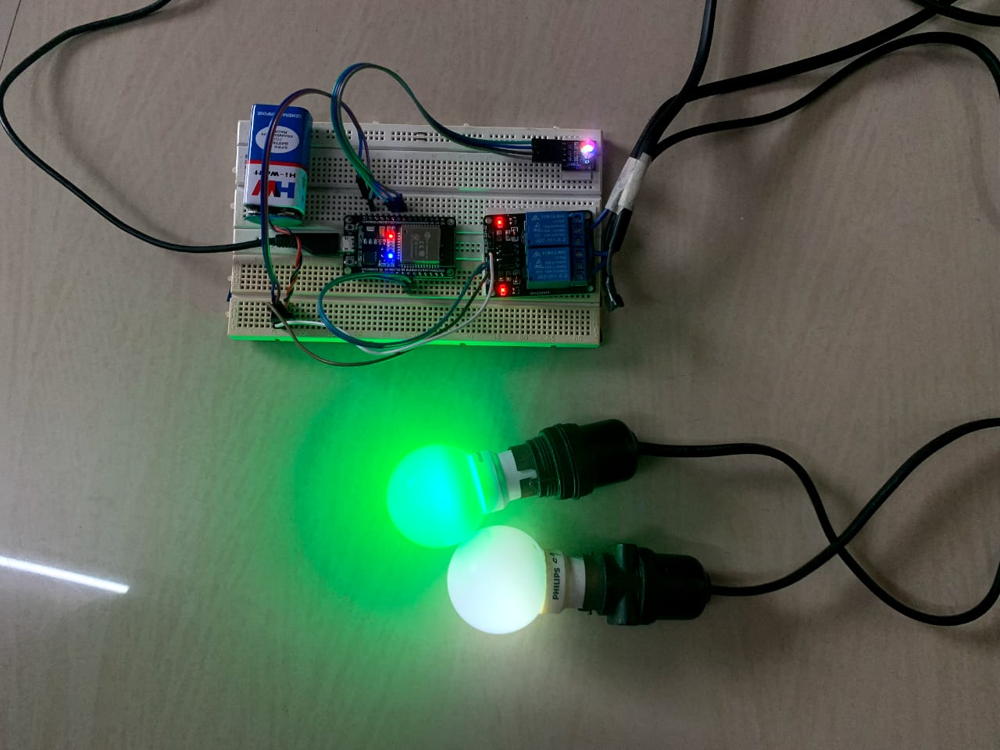

## IOT Project

This project aims at developing a system that simulates home automation in IOT. This system consists of a controller board -ie- ESP32 module, and Bulbs that are to be controlled using an Android App. We aim to implement digital output (ON/OFF) by turning on/off the bulbs; and analog output (varying the intensity) by changing the colour of RGB LED bulb.
The app and the ESP32 module is connected to an online database (Firebase Database). On click of a button the on the app, the values of different variables change in the database in real-time. The ESP32 reads the value of the variables and accordingly changes the state of the peripheral devices (bulbs).

### 🔗 Content

* [Overview](#iot-project)
* [Content](#-content)
* [Features](#-features)
* [Flow Diagram](#-flow-diagram)
* [Componants Required](#-componants-required)
* [Circuit Diagram](#-circuit-diagram)
* [Database Design](#-database-design)
* [code](#-code)
* [Documentation](#-documentation)
* [Demo](#-demo)
* [Images](#-images)
* [Author](#-author)
 

### 📋 Features

- Turning ON/OFF Relays. Bulb or fan or any other applience can be turend ON/OFF.

- Turning ON/OFF RGB LED. 

- Changing colour of the RBG LED, by changing the intensity of Red, Green and Blue colour.

### 🧠 Flow Diagram

### 🔩 Componants Required

**HARDWARE REQUIREMENTS**
- The Hardware components used for this project are
    - ESP32 Module
    - LED Bulbs
    - RGB Module
    - Relay
- Additional Peripherals used
    - Battery (or any other power source) 
    - Jumper wires
    - Holders
    - Breadboard
**SOFTWARE REQUIREMENTS**
- The Software used for this project are
    - Android studio (for developing the app) - Arduino IDE (for coding the ESP32)
    - Firebase (database)

### 🔗 Circuit Diagram

### 🗂 Database Design

### 🕹 Code

- **Frontend code :** https://github.com/AkashCSanjeev/IOT

- **Hardware code :** https://github.com/atharvparkhe/iot

### 📄 Documentation

The docs folder contain all the project documentations and screenshots of the project.

- Read the *Project Report* [here](docs/project-report.pdf)

### 🧑🏻‍💻 Demo

YouTube Link : https://youtu.be/SxM_EhIoMEc

### 🌄 Images

- **Android App**

- **Project**

### 🙋🏻‍♂️ Author

**🤝 Connect with Atharva Parkhe**

